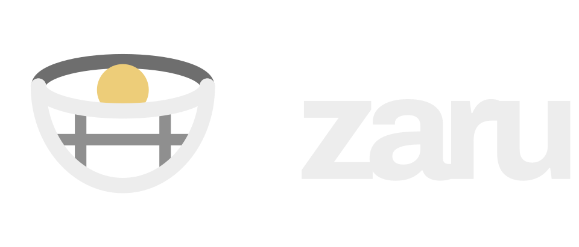

Culling de fotos RAW pelo teclado. Uma tecla por foto, avanço automático, sem
mouse e sem espera.

Depois de uma sessão em rajada sobram centenas ou milhares de CR3. Lightroom e
darktable levam segundos por foto para montar preview. Zaru não renderiza RAW:
serve o JPEG que a própria câmera já gravou dentro do arquivo.

Câmera alvo: Canon EOS R50 (CR3).

## Estado

**Completo.** Navegação, marcação, desfazer, coleções, gravação de XMP, mover
arquivos e o acabamento visual.

| Crate | O quê |
|---|---|
| `zaru-bmff` | Percorre caixas ISO-BMFF. CR3 e MP4 são o mesmo tipo de arquivo. |
| `zaru-cr3` | Acha o JPEG embutido, a orientação e o EXIF. |
| `zaru-video` | Duração, tamanho, rotação e hora de um MP4, só do cabeçalho. |
| `zaru-xmp` | Lê, mescla e escreve `xmp:Rating` / `xmp:Label`. Zero dependências. |
| `zaru-core` | Sessão, marcas, desfazer, preferências, prefetch. Sem Tauri. |
| `src-tauri` | Janela, protocolo `zaru://` e os comandos. Só fiação. |
| `tools/ui-preview` | Renderiza a interface sem webview e tira screenshots. |

`zaru-core` não depende do Tauri de propósito: a máquina de desenvolvimento não
tem display, e sem isso a lógica das fases 1 e 2 ficaria sem teste nenhum.

```
cargo test --workspace --exclude zaru      # 113 testes, sem webview
cargo run --bin zaru-probe -- example_cr3.CR3 -o preview.jpg
cargo run --bin zaru-mark  -- IMG_4821.CR3 --rating 4 --label Green
cargo build --release --target x86_64-pc-windows-gnu
```

O app compila e linka para Windows a partir do Linux com `mingw-w64`, sem
`webkit2gtk` e sem CI. O único arquivo que precisa acompanhar o `zaru.exe` é a
`WebView2Loader.dll` que o build já deposita ao lado dele.

A máquina de desenvolvimento não tem display nem webview, então a interface não
roda nela. `node tools/ui-preview/preview.js` a desenha no Chromium do
Playwright com a ponte do Tauri dublada e escreve as telas em
`target/ui-preview/` — é o único jeito de olhar o resultado sem passar o
binário para outro computador.

## Teclas

| Tecla | Ação |
|---|---|
| `K` / `H` | foto anterior / próxima |
| `A` `R` `S` `T` `G` | 1 a 5 estrelas; a mesma tecla zera |
| `Espaço` | etiqueta verde |
| `Backspace` | rejeita e avança |
| `Alt+K` / `Alt+H` | rajada anterior / próxima |
| `Z` | alterna 1:1 e ajustado |
| `V` | fixa esta foto para comparar |
| `D` | filtra o que aparece |
| `N` / `M` | nova coleção / mover para uma coleção |
| `Esc` | volta ao enquadramento inteiro |
| `Ctrl+Z` / `Ctrl+Shift+Z` | desfaz / refaz |
| `Ctrl+Enter` | aplicar |
| `O` / `C` / `?` | abrir pasta / ajustes / teclas |

Tudo é lido de `event.key`, nunca de `event.code`. Com Colemak-DH ativo no
sistema operacional, a tecla do `R` reporta `KeyS`, que é a posição física no
QWERTY; com o layout no firmware do teclado, as duas coincidem. `event.key`
funciona nos dois casos.

Estrela e etiqueta **não** avançam a foto — o usuário dá nota, olha de novo e
só então decide. Rejeitar avança, porque é a única decisão terminal.

## Como a navegação não espera

Nenhum byte de imagem passa pelo canal de comandos. Serializar um megabyte de
JPEG em base64 a cada tecla produz exatamente a latência que o app existe para
eliminar. As imagens saem por um esquema de URI próprio, `zaru://<índice>`, e o
front-end é uma ``.

O prefetch tem duas camadas, porque o custo mudou de lugar: extrair não
decodifica nada, então o gargalo é o decode do JPEG de 6000×4000 pelo WebView.

- **Rust** mantém em memória as 5 fotos à frente e 3 atrás, lidas por um pool
  de threads. Isso paga o disco antecipadamente.
- **JavaScript** mantém um anel de 9 elementos `` já decodificados via
  `img.decode()`. A tecla só troca qual deles está visível.

A seção Diagnóstico de navegação, em Ajustes, mostra a mediana e o p95 do tempo entre a tecla e a pintura,
medidos ao vivo. O critério de aceite da Fase 1 é um número, não uma impressão:
**12,3 ms** medidos numa pasta real, contra um orçamento de 16 ms — um frame a
60 Hz.

Por isso o plano de contingência não existe: estava previsto cair para a prévia
`PRVW` de 1620×1080 durante a navegação rápida se o decode da imagem inteira não
coubesse no orçamento. Coube. A resolução total fica o tempo todo.

## Onde fica a prévia num CR3

Um CR3 é um arquivo ISO-BMFF. A documentação informal costuma dizer que a
prévia grande está numa box `prvw`; no arquivo real ela não está. Medido em
`example_cr3.CR3`:

```
ftyp  @0        24 B
moov  @24       26720 B
  uuid 85c0b687…   CMT1 CMT2 CMT3 CMT4 THMB
  trak #1 → mdia/minf/stbl → co64 = 206848   stsz = 1150804   stsd = 6000×4000
  trak #2, trak #3
uuid  @26744    be7acfcb…
uuid  @92304    eaf42b5e…  → PRVW  1620×1080, 114 KB
mdat  @206832   28271484 B
```

| Fonte | Tamanho | Pixels |
|---|---|---|
| `THMB` | 7 KB | thumbnail |
| **sample do trak #1** | **1.15 MB** | **6000×4000** |
| `PRVW` | 114 KB | 1620×1080 |

Zaru serve o sample do trak #1: resolução total, qualidade 82, sRGB. Localizar
custa um punhado de leituras no `moov`; entregar custa um `seek` e um `read`.
**Não há decodificação de imagem no lado Rust** — quem decodifica é o WebView.

Dois detalhes que o container esconde:

- **O JPEG do trak #1 não tem segmento Exif.** A orientação vem da box `CMT1`,
  que é uma IFD0 TIFF pura (tag `0x0112`). Sem ler dali, toda foto em retrato
  aparece deitada.
- **Nem todo CR3 põe um JPEG no trak #1.** A varredura de tracks é protegida
  pelo magic `FF D8 FF` e cai para a box `PRVW` quando nenhum track serve.

## Inspeção

A prévia tem 6000×4000 e a tela mostra ~1400 px: 23% de escala. Isso decide
enquadramento, não decide se o autofoco pegou o capacete do piloto. Daí o zoom.

Roda do mouse dá zoom no ponto sob o cursor, arrastar move, `Z` alterna entre
ajustado e 1:1, `Esc` volta ao inteiro. **O zoom não se perde ao trocar de
foto** — de propósito: ampliar onde estava o ponto de foco e percorrer a rajada
a 100% é a razão de o zoom existir, e zerar a cada tecla o tornaria inútil
justamente para isso.

Não custa decodificação nenhuma. O bitmap 6000×4000 já está no WebView; zoom é
uma transformação sobre o que já existe.

`V` fixa a foto atual ao lado da passada. Os dois painéis dividem **um** zoom e
**um** pan, que é o que faz a comparação significar alguma coisa: o mesmo canto
dos dois quadros, na mesma ampliação. Cada painel recorta o seu — sem isso uma
imagem ampliada transborda quatro mil pixels e as duas se pintam por cima.

## Rajadas

`CMT2` é o IFD Exif e carrega `DateTimeOriginal` mais `SubSecTimeOriginal`.
Quadros com menos de 700 ms entre si são a mesma rajada: uma câmera em disparo
contínuo põe oitenta milissegundos entre quadros, e apertar o botão de novo
demora mais que isso.

`Alt+H` e `Alt+K` pulam de rajada em rajada. Numa passada de automobilismo
a unidade de decisão é a rajada, não o quadro — você quer *uma* foto daquele
carro naquela curva, não um veredito sobre as doze.

Quadro sem data forma rajada própria em vez de ser dobrado no vizinho: chutar
poria um quadro alheio dentro de um grupo que o usuário depois julga como um.

## Filtro

`D` restringe a navegação: sem marcação, com nota, 5 estrelas, verde,
rejeitadas, em coleção, sem coleção. A segunda passada deixa de ser 1240 fotos.

Um filtro é uma lista de índices, e toda navegação anda por ela. É também por
isso que o prefetch recebe do front-end **quais** quadros manter, em vez de
deduzir a partir de uma posição: com filtro ligado, "as próximas cinco" é uma
caminhada por um subconjunto, e vizinho na lista de arquivos não é vizinho na
passada.

Desfazer sobrepõe o filtro. Se a foto reparada está escondida, o filtro cede —
o reparo importa mais que a vista.

## Recuperação

Duas mil fotos e uma hora de julgamento vivem em memória até o Aplicar. Uma
cópia de rascunho vai para o diretório de configuração a cada três segundos,
quando há algo mudado — nunca a cada tecla, porque essa escrita não tem nada
que fazer dentro do laço de triagem.

Reabrir a pasta oferece o que ficou, e aceita não como resposta. O arquivo é
apagado no Aplicar. Isso **não** é um catálogo: a pasta continua sendo a única
verdade, o arquivo não guarda nada que não esteja prestes a virar sidecar, e
ele é validado contra a lista de fotos antes de ser oferecido — uma foto a mais
ou a menos e os índices não querem dizer nada.

## Vídeo

A R50 grava MP4 na mesma pasta, e um MP4 é o mesmo tipo de contêiner que um
CR3 — o mesmo percorredor de caixas acha os dois. Duração, tamanho, rotação e a
hora em que a gravação começou saem todas do `moov`, então o Zaru aprende tudo
que precisa sobre um arquivo de dois gigabytes lendo algumas centenas de bytes
dele.

Vídeo é cidadão pleno: aparece na passada, recebe nota, verde e rejeição, entra
em coleção e ganha `.xmp` pela mesma regra de *stem* das fotos.

Duas coisas mudam, e nenhuma é disfarçada. **Zoom e comparação ficam
desligados** — um clipe não tem quadro fixo para ampliar nem still para
confrontar, e um controle que finge o contrário é pior que um desligado. E um
clipe **nunca entra numa rajada de fotos**: proximidade de relógio o juntaria a
quadros que não se comparam com ele.

A miniatura vem do WebView, porque ele tem decodificador de vídeo e o Rust não:
um `<video>` busca meio segundo, a JS captura o quadro e devolve os bytes, que
entram no mesmo cache das fotos. Da segunda vez em diante é acerto de disco.

Para tocar, o protocolo passou a responder `Range`. Sem `206` o `<video>` não
busca, e cada pedido puxaria o arquivo inteiro para a memória — o que para
alguns minutos de 4K são gigabytes.

## Coleções

Uma coleção é uma subpasta da pasta de trabalho. Sem banco, sem catálogo, sem
estado escondido.

```
2026-09-05-interlagos/
├── IMG_4820.CR3
├── IMG_4820.xmp
├── porsche/
├── ferrari/
└── descarte/
```

`N` cria — modal longo, campo de texto, e enquanto está aberto **todas** as
teclas pertencem ao campo; sem isso o usuário entra no modo sem querer e as
próximas cinco teclas viram nome de pasta.

Atribuir é uma tecla só, direto, sem modal: a fileira de cima manda a foto para
a coleção correspondente. A mesma tecla tira de novo, como acontece com as
estrelas. `Alt` junto manda a **rajada inteira** — no automobilismo a rajada é
o mesmo carro na mesma curva, então quase sempre pertence ao mesmo lugar, e
decidir isso doze vezes são doze chances de escorregar. Vai como **um** passo
de desfazer, porque foi uma decisão.

`M` continua existindo, mas como consulta: abre a lista com as teclas ao lado
dos nomes. O limite de coleções é quantas teclas estão mapeadas — uma coleção
que o teclado não alcança não vale a pena existir. Uma foto pertence a no
máximo uma.

Nada disso toca o disco durante a triagem. Mover arquivo no meio do laço
invalidaria o índice da lista, que é todo o senso de "onde estou" do app, e
faria "próxima foto" significar coisa diferente a cada tecla. As coleções vivem
em memória até o passo de Aplicar; abandonar a sessão não deixa pasta vazia
para trás.

## Aplicar

`Ctrl+Enter` mostra o que vai acontecer antes de acontecer:

```
487  fotos avaliadas
312  vão receber .xmp
 84  vão para porsche/ (168 arquivos)
 61  vão para ferrari/
103  rejeitadas — permanecem onde estão
753  sem marcação, ficam como estão
```

Mover arquivo é a única coisa irreversível que o Zaru faz, então a prévia não é
enfeite. Colisões de nome são detectadas **antes** de qualquer escrita, e
enquanto existir uma o Aplicar se recusa a começar — nada pela metade.

Depois de confirmar: os `.xmp` primeiro, os moves depois. Nessa ordem sempre,
senão o sidecar recém-escrito ficaria para trás enquanto a foto vai para a
coleção. Cada CR3 leva junto tudo que compartilha o *stem* — o `.xmp` e o
`.JPG` irmão, se a câmera estava em RAW+JPEG. O casamento é pelo prefixo
`nome.`, e não pelo *stem* que o sistema calcula, porque o sidecar do darktable
é `IMG_4821.CR3.xmp`: o *stem* dele é `IMG_4821.CR3`, não `IMG_4821`. O ponto no
prefixo é o que mantém `IMG_48210.CR3` de fora.

Se um move falhar — permissão, disco cheio — a execução para ali, diz em qual
arquivo, e tudo depois dele fica intacto.

## Direção visual

Estúdio escuro: visor neutro `#1c1c1c`, barras em `#242424`, divisórias
discretas e controles compactos. A foto mantém sua cor, sem bordas, sombras ou
transições. Archivo variável continua empacotada localmente para uso offline.

As ferramentas ficam no topo; navegação, estrelas, etiqueta, rejeição,
comparação e zoom ficam embaixo. Toda ação de triagem está disponível por
teclado e por controles visíveis, com dicas que acompanham o remapeamento.
Coleções têm um painel recolhível de 260 px; abaixo de 1100 px ele se sobrepõe
ao visor e ações secundárias ficam no menu Mais.

Diálogos contêm o foco e oferecem botões de fechar/cancelar. Filtros vazios
continuam selecionados e oferecem Limpar filtro. Esc fecha a recuperação sem
apagar o rascunho; somente Descartar o remove. Revisar e aplicar apresenta o
plano antes da gravação e bloqueia interações durante a execução.

`node tools/ui-preview/preview.js` captura os fluxos e executa regressões de
clique/teclado, filtros vazios, comparação, foco, recuperação e aplicação.
Também salva prints `before-*` (fontes de HEAD) e `after-*` em 1400×900,
1024×768 e 800×600, em `target/ui-preview/`. O print de relatório confirma a
aplicação na ponte simulada antes de capturar o resultado. Os testes de
interface não substituem uma validação da janela nativa no Windows.

## Sidecar XMP

`xmp:Rating` acumula dois papéis: `-1` é rejeitado, `0` é sem nota, `1..=5` são
estrelas. Rejeição e nota disputam o mesmo campo — dar estrela numa foto
rejeitada tira a rejeição, e isso é correto, não é limitação. `xmp:Label` guarda
a cor, uma só por foto.

A mesclagem é cirúrgica: reescreve essas duas propriedades e deixa o resto do
arquivo byte a byte como estava, porque o sidecar pode já conter revelação,
palavras-chave ou recorte. As duas serializações são tratadas — Lightroom
escreve as propriedades como atributos de `rdf:Description`, darktable como
elementos filhos.

Os dois programas também discordam do nome do arquivo, então a escolha é
explícita — em **Ajustes** (`C`) no app, ou por argumento no `zaru-mark`:

| Ajuste | Resultado |
|---|---|
| Lightroom (padrão) | `IMG_4821.xmp` |
| darktable (`--darktable`) | `IMG_4821.CR3.xmp` |
| Os dois | os dois nomes, mesmo conteúdo |

A opção "os dois" existe porque nenhum dos dois programas lê o nome do outro de
forma confiável, e adivinhar no código seria pior do que perguntar. Custa um
arquivo pequeno a mais por foto.

## O que Zaru não faz

Não apaga arquivo, nunca. Rejeitar é uma anotação no XMP e nada além disso — o
que fazer com as rejeitadas depois é decisão sua, com as suas ferramentas.
Também não revela RAW, não edita, não mantém catálogo e não importa cartão.

## Integração contínua

`.github/workflows/ci.yml` roda os testes e o clippy no Linux e **compila o
`.exe` do Windows por cross-compile no mesmo runner** — o app linka contra o
WebView2, não contra um webview do sistema, então mingw basta. O artefato
`Zaru-win64` sai pronto de cada push.

## Marca

Um *zaru* (笊) é o cesto de bambu que escorre: o que importa fica, o resto passa.
O ícone é essa peneira vista de ângulo, com uma coisa retida dentro — que é
exatamente o que uma passada de triagem faz.

O ângulo não é enfeite. Desenhada de frente, a peneira vira rim reto sobre arco
e o conjunto lê como uma boca sorrindo; a elipse do rim é o que a devolve a
objeto. Abaixo de uns 24 px a trama vira lama cinza e custa mais contraste do
que carrega significado, então os tamanhos pequenos do `.ico` guardam só a
silhueta — a fonte deles é um segundo SVG, não uma redução do primeiro.

Os SVG em `assets/` e `src-tauri/icons/` são a fonte; os `.png` e o `.ico` são
derivados e não se editam à mão:

```
tools/icon/build.sh        # precisa de rsvg-convert e ImageMagick
```

A palavra "zaru" do logotipo é a Archivo no peso 750 com o mesmo espacejamento
da marca no app, convertida em contornos para o arquivo não depender de fonte
instalada.

## Licença

MIT ou Apache-2.0.

A fonte Archivo, em `ui/fonts/`, é de Omnibus-Type e está sob a SIL Open Font
License 1.1 — o texto da licença acompanha os arquivos em `ui/fonts/OFL.txt`.
